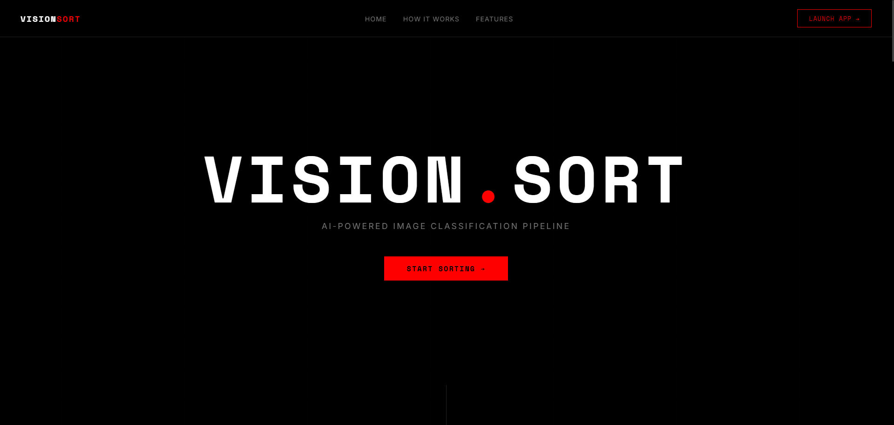

# VisionSort — Comprehensive Project Report
> **AI-Powered Image Categorization & Enhancement System**

VisionSort is a state-of-the-art, AI-powered image organization system designed to automate the sorting of large photo collections. It uses a hybrid approach—combining classical computer vision techniques with deep learning—to classify images into meaningful categories without requiring any custom training. 

Recently updated with a striking **"Nothing Brand" inspired aesthetic**, the system provides a premium scrollytelling frontend and a robust FastAPI backend.



---

## 1. Problem Statement

Managing and organizing large collections of images is time-consuming and error-prone when done manually. Photographers, content creators, and everyday users frequently accumulate hundreds or thousands of images that need sorting. Additionally, identifying blurred, low-quality, or meaningless shots (like accidental captures or partial crops) requires tedious manual review. 

VisionSort automates this entire process, bringing order to the chaos.

---

## 2. Proposed Solution

VisionSort uses a two-stage approach:

1. **Classical CV Heuristics** — Fast, lightweight checks for blur and face detection using OpenCV, avoiding unnecessary ML inference.
2. **Deep Learning Classification** — A pretrained EfficientNet-B0 model (trained on ImageNet-1K) is used for object/scene recognition to determine the final category.
3. **Automated Enhancement** — The system allows users to apply category-specific enhancement presets (e.g., Portrait smoothing, Landscape HDR) before downloading the final sorted ZIP archive.

---

## 3. Tech Stack

### Backend / API
* **Python 3.10+**
* **FastAPI**: Async REST framework with auto Swagger docs.
* **Uvicorn**: ASGI server.
* **python-multipart**: Required for `multipart/form-data` bulk file uploads.

### Machine Learning & Computer Vision
* **PyTorch & Torchvision**: Deep learning inference engine providing the EfficientNet-B0 pretrained model.
* **EfficientNet-B0**: ImageNet-1K pretrained model (1000 classes) used zero-shot.
* **OpenCV (`cv2`)**: Blur detection (Laplacian), face detection (Haar cascades), entropy computation.
* **Pillow (PIL) & NumPy**: Image loading, format handling, and array operations.

### Frontend
* **Vanilla HTML5, CSS3, JavaScript**: No heavy frameworks, purely built for performance.
* **Design System**: "Nothing" brand aesthetic—pitch black (`#000000`), stark white text, 1px structural borders, and subtle neon red (`#FF0000`) accents.
* **Typography**: `Space Mono` for dot-matrix style headings and `Inter` for clean body text.

---

## 4. System Architecture

```text
┌─────────────────────────────────────────┐
│         Frontend (Vanilla JS/CSS)       │
│   Scrollytelling → Upload → Presets     │
└──────────────────┬──────────────────────┘
                   │  REST API (multipart/form-data)
┌──────────────────▼──────────────────────┐
│          Backend (FastAPI)              │
│                                         │
│  POST /api/classify/batch ← Upload      │
│  GET  /api/session/{id}/status          │
│  POST /api/process        ← Download    │
│                                         │
│  ┌─────────────────────────────────┐    │
│  │     VisionSortPipeline          │    │
│  │                                 │    │
│  │  OpenCV:                        │    │
│  │   • Blur Detection (Laplacian)  │    │
│  │   • Face Detection (Haar)       │    │
│  │   • Entropy (Shannon)           │    │
│  │                                 │    │
│  │  PyTorch:                       │    │
│  │   • EfficientNet-B0 Inference   │    │
│  └─────────────────────────────────┘    │
└─────────────────────────────────────────┘
```

---

## 5. Classification Categories

VisionSort classifies every image into exactly one of these categories:

| Category | Description | Detection Method |
|---|---|---|
| `blurred` | Out-of-focus or motion-blurred images | OpenCV Laplacian variance |
| `people` | Images containing human faces | OpenCV Haar cascade face detector |
| `animals` | Images of animals (fish, birds, mammals) | ImageNet class indices 0–397 |
| `aesthetic` | Visually meaningful images (buildings, cars) | Curated ImageNet whitelisted classes |
| `uncategorized` | Recognizable photos lacking the "wow factor" | EfficientNet residual category |
| `unlabelled` | Nonsense images (partial crops, noise) | Low model confidence / low entropy |

---

## 6. Algorithmic Pipeline — Deep Dive

The `VisionSortPipeline` class is the heart of VisionSort. It executes the following 5-step logic for every image:

### Step 1 — Blur Detection
```python
gray = cv2.cvtColor(img_array, cv2.COLOR_RGB2GRAY)
laplacian = cv2.Laplacian(gray, cv2.CV_64F)
blur_score = float(laplacian.var())
```
The Laplacian operator measures high-frequency responses (sharpness). If the `blur_score` is below `100.0`, the image is immediately flagged as **`blurred`**.

### Step 2 — Shannon Entropy
```python
hist = cv2.calcHist([gray], [0], None, [256], [0, 256])
# ... normalization ...
entropy = float(-np.sum(hist * np.log2(hist)))
```
Entropy measures the informational complexity of the image. A completely blank or solid-color image has low entropy. This is used as a quality gate.

### Step 3 — Face Detection
```python
frontal = face_cascade_frontal.detectMultiScale(gray, scaleFactor=1.1, minNeighbors=5, minSize=(30,30))
profile = face_cascade_profile.detectMultiScale(...)
faces_detected = max(len(frontal), len(profile))
```
Two Haar cascades run independently. If `faces_detected > 0`, the image is strongly biased toward the **`people`** category.

### Step 4 — EfficientNet Inference
```python
@torch.no_grad()
def _predict(self, image):
    tensor = self.transform(image).unsqueeze(0).to(self.device)
    output = self.model(tensor)
    probs = F.softmax(output, dim=1).squeeze(0)
    # Returns top 3 predictions
```
The image is passed through EfficientNet-B0 to extract object/scene probabilities.

### Step 5 — Decision Logic (Priority Order)
1. If `blur_score < 100` → **blurred**
2. If `faces_detected > 0` → **people**
3. If `top_confidence < 0.10` → **unlabelled**
4. If `entropy < 4.5` and `top_confidence < 0.25` → **unlabelled**
5. If `class_idx ∈ [0, 397]` → **animals**
6. If `class_idx` is in the curated aesthetic whitelist AND `confidence >= 0.40` → **aesthetic**
7. Else → **uncategorized**

---

## 7. How to Run Locally

You will need two terminal windows to run both the backend and frontend simultaneously.

### Start the Backend API
```powershell
cd VisionSort
.venv\Scripts\python.exe -m uvicorn backend.app.main:app --reload --port 8000
```
*The backend will load the EfficientNet weights into memory and start serving on port 8000.*

### Start the Frontend Server
```powershell
cd VisionSort\frontend
python -m http.server 8080
```
*Open your browser and navigate to **http://localhost:8080***

---

## 8. Key Design Decisions

| Decision | Rationale |
|---|---|
| **Zero-shot (no custom training)** | Uses ImageNet pretrained EfficientNet-B0 directly — avoids needing a custom labeled dataset. |
| **Priority-based logic** | Blur and faces are checked first because classical CV heuristics are highly reliable for these specific traits. |
| **Vanilla JS Frontend** | Avoided React to keep the repository extremely lightweight and fast. IntersectionObservers handle the complex scrollytelling animations seamlessly. |
| **Session State Validation** | The frontend pings `GET /api/session/{id}/status` before processing to guarantee the backend hasn't dropped the in-memory session, ensuring zero crashes. |
| **`max(frontal, profile)`** | Deduplicates overlapping Haar detections from the two cascades. |

---
*VisionSort — Minor Project, 6th Semester*
